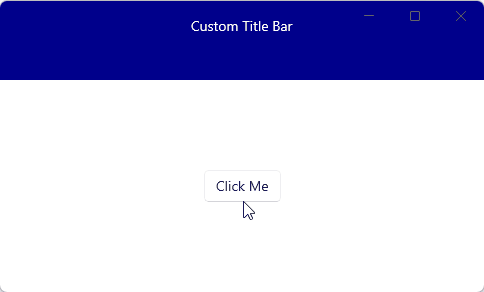

# Describe the bug

When using a custom title bar that extends own content into the title bar, flyouts that are opened over the custom title bar receive no input.
The mouse input is interpreted as a hover and click on the title bar, not on the items in the flyout.
Trying to click on the top item in the flyout is instead interpreted as a window movement when clicking and dragging.
Double-clicking on the top flyout item maximizes the window.

Also, the title bar control buttons for minimize, maximize and closing the window are given priority over the flyout that is displayed above.

# Bug report

Bug has been submitted to the microsoft-ui-xaml project here: https://github.com/microsoft/microsoft-ui-xaml/issues/9463

# Steps to reproduce the bug

Use AppWindowTitleBar.ExtendsContentIntoTitleBar and SetDragRectangles to extend custom content into the title bar of the window.
(See WindowTitleHelper.cs in reproduction sample)

Use a simple XAML Window with a Flyout that is tall enough to open over the custom title bar. The Window needs to be the exact right size so that the Flyout is extended over the title bar content.

```
<Window
  x:Class="WinUICustomTitleBarInhibitsControlInput.MainWindow"
  xmlns="http://schemas.microsoft.com/winfx/2006/xaml/presentation"
  xmlns:x="http://schemas.microsoft.com/winfx/2006/xaml"
  xmlns:d="http://schemas.microsoft.com/expression/blend/2008"
  xmlns:mc="http://schemas.openxmlformats.org/markup-compatibility/2006"
  mc:Ignorable="d">

  <Grid RowDefinitions="80,*">

    <StackPanel x:Name="MenuBarContent" Grid.Row="0" Background="DarkBlue" Padding="16">
      <TextBlock Text="Custom Title Bar" HorizontalAlignment="Center" VerticalAlignment="Center" Foreground="White"/>
    </StackPanel>

    <StackPanel Grid.Row="1" Orientation="Horizontal" HorizontalAlignment="Center" VerticalAlignment="Center">
      <Button Content="Click Me">
        <Button.Flyout>
          <Flyout Placement="Right">
            <ListView>
              <ListView.Items>
                <ListViewItem>Item 1</ListViewItem>
                <ListViewItem>Item 2</ListViewItem>
                <ListViewItem>Item 3</ListViewItem>
                <ListViewItem>Item 4</ListViewItem>
                <ListViewItem>Item 5</ListViewItem>
                <ListViewItem>Item 6</ListViewItem>
                <ListViewItem>Item 7</ListViewItem>
                <ListViewItem>Item 8</ListViewItem>
                <ListViewItem>Item 9</ListViewItem>
              </ListView.Items>
            </ListView>
          </Flyout>
        </Button.Flyout>
      </Button>

    </StackPanel>
  </Grid>
</Window>
```



# Expected behavior

The first item in the flyout shall be clickable and when hovering over the item the focus background shall be displayed.

# NuGet package version

MicrosoftWindowAppSDK 1.5.240311000

# Windows version

Windows 11 23H2 (22631.3155)
